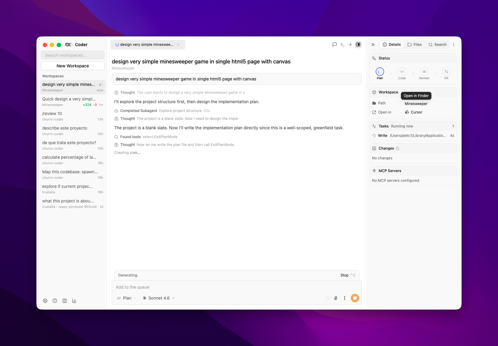
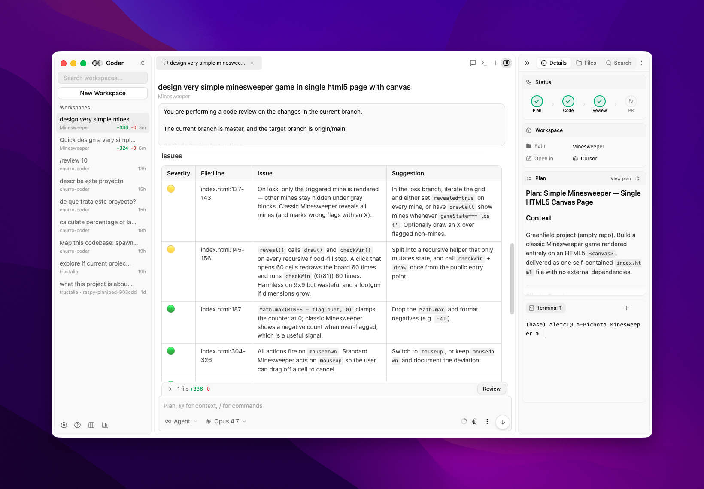
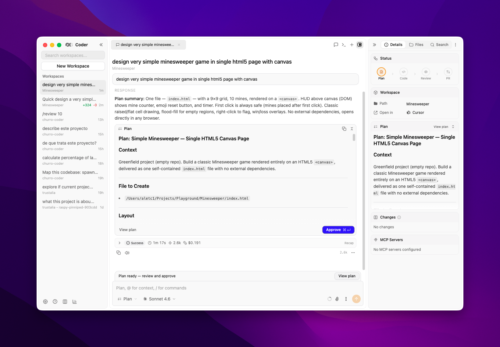

# Churro Coder

Open-source, fully offline coding agent client. Run Claude Code, Codex, and more — locally, no cloud account needed.

## Notable changes from upstream

- **Refactored windowing system (dockview-based)** — every open workspace runs in its own dock instance, stacked invisibly so terminal PTYs and chat streams keep running across workspace switches. Sub-chats / terminals / files / plan / diff / search are first-class dockview tabs (drag to split, double-click to rename, per-group `[+]` / Chat / Terminal, hotkeys: `⌘T` new chat, `⌘⇧T` new terminal, `⌘P` file picker, `⌘⇧F` project search, `⌘D` Changes panel). Per-workspace layout persists across reloads.
- **Latest models** — Claude Opus 4.7, Sonnet 4.6 with optional 1M context (`sonnet[1m]`, one-click downgrade on rate limits), plus GPT-5.4 / GPT-5.4 Mini for Codex.
- **Per-mode model & thinking presets** — set Claude's default model and thinking budget independently for Plan and Agent modes; switches automatically when the mode changes.
- **Usage statistics** — built-in token + cost dashboard for Claude and Codex.
- **PR widget + git ergonomics** — inline PR comments / details next to the chat, branch-switcher popover with instant refresh (no polling wait), and a one-click push-recovery dialog (auto-stash + rebase + re-push) when the remote is ahead.

---

## Highlights

- **Multi-Agent Support** - Claude Code and Codex in one app, switch instantly
- **Visual UI** - Cursor-like desktop app with diff previews and real-time tool execution
- **Custom Models & Providers (BYOK)** - Bring your own API keys
- **Git Worktree Isolation** - Each chat runs in its own isolated worktree
- **Background Agents** - Run agents in background while you continue working
- **Live Browser Previews** - Preview dev branches in a real browser
- **Kanban Board** - Visualize agent sessions
- **Built-in Git Client** - Visual staging, diffs, PR creation, push to GitHub
- **File Viewer** - File preview with Cmd+P search and image viewer
- **Integrated Terminal** - Sidebar or bottom panel with Cmd+J toggle
- **Model Selector** - Switch between models and providers
- **MCP & Plugins** - Server management, plugin marketplace, rich tool display
- **Automations** - Trigger agents from GitHub, Linear, Slack, or manually from git events
- **Chat Forking** - Fork a sub-chat from any assistant message
- **Message Queue** - Queue prompts while an agent is working
- **API** - Run agents programmatically with a single API call
- **Voice Input** - Hold-to-talk dictation
- **Plan Mode** - Structured plans with markdown preview
- **Extended Thinking** - Enabled by default with visual UX
- **Skills & Slash Commands** - Custom skills and slash commands
- **Custom Sub-agents** - Visual task display in sidebar
- **Memory** - CLAUDE.md and AGENTS.md support
- **PWA** - Start and monitor background agents from your phone
- **Cross Platform** - macOS desktop, web app, Windows and Linux

## Features

### Run coding agents the right way

Run agents locally, in worktrees, in background - without touching main branch.



- **Git Worktree Isolation** - Each chat session runs in its own isolated worktree
- **Background Execution** - Run agents in background while you continue working
- **Local-first** - All code stays on your machine, no cloud sync required
- **Branch Safety** - Never accidentally commit to main branch
- **Shared Terminals** - Share terminal sessions across local-mode workspaces

---

### UI that finally respects your code

Cursor-like UI with diff previews, built-in git client, and the ability to see changes before they land.



- **Diff Previews** - See exactly what changes the agent is making in real-time
- **Built-in Git Client** - Stage, commit, push to GitHub, and manage branches without leaving the app
- **Git Activity Badges** - See git operations directly on agent messages
- **Rollback** - Roll back changes from any user message bubble
- **Real-time Tool Execution** - See bash commands, file edits, and web searches as they happen
- **File Viewer** - File preview with Cmd+P search, syntax highlighting, and image viewer
- **Chat Forking** - Fork a sub-chat from any assistant message to explore alternatives
- **Chat Export** - Export conversations for sharing or archival
- **File Mentions** - Reference files directly in chat with @ mentions
- **Message Queue** - Queue up prompts while an agent is working

---

### Plan mode that actually helps you think

The agent asks clarifying questions, builds structured plans, and shows clean markdown preview - all before execution.



- **Clarifying Questions** - The agent asks what it needs to know before starting
- **Structured Plans** - See step-by-step breakdown of what will happen
- **Clean Markdown Preview** - Review plans in readable format
- **Review Before Execution** - Approve or modify the plan before the agent acts
- **Extended Thinking** - Enabled by default with visual thinking gradient
- **Sub-agents** - Visual task list for sub-agents in the details sidebar

---

### Connect anything with MCP

Full MCP server lifecycle management with a built-in plugin marketplace. No config files needed.

- **MCP Server Management** - Toggle, configure, and delete MCP servers from the UI
- **Plugin Marketplace** - Browse and install plugins with one click
- **Rich Tool Display** - See MCP tool calls with formatted inputs and outputs
- **@ Mentions** - Reference MCP servers directly in chat input

---

### Automations

Trigger agents from git events, run automated reviews, and configure conditions and filters. Visual execution timeline for past runs.

## Installation

### Option 1: Build from source (free)

```bash
# Prerequisites: Bun, Python 3.11, setuptools, Xcode Command Line Tools (macOS)
bun install
bun run claude:download  # Download Claude binary (required!)
bun run codex:download   # Download Codex binary (required!)
bun run build
bun run package:mac  # or package:win, package:linux
```

> **Important:** The `claude:download` and `codex:download` steps download required agent binaries. If you skip them, the app may build but agent functionality will not work correctly.
>
> **Python note:** Python 3.11 is recommended for native module rebuilds. On Python 3.12+, make sure `setuptools` is installed (`pip install setuptools`).

## Development

```bash
bun install
bun run claude:download  # First time only
bun run codex:download   # First time only
bun run dev
```

## Feedback & Community

Join our [Discord](https://discord.gg/8ektTZGnj4) for support and discussions.

## License

Apache License 2.0 - see [LICENSE](LICENSE) for details.

---

*Originally based on [21st-dev/1code](https://github.com/21st-dev/1code).*
